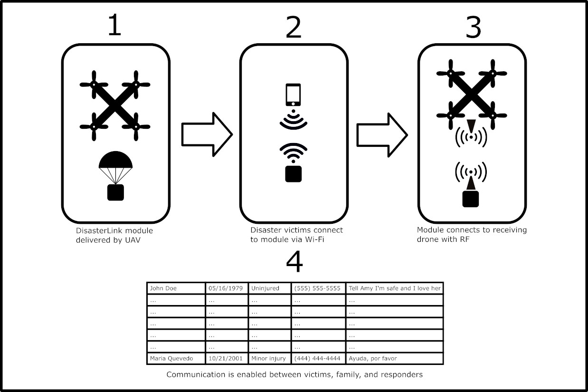
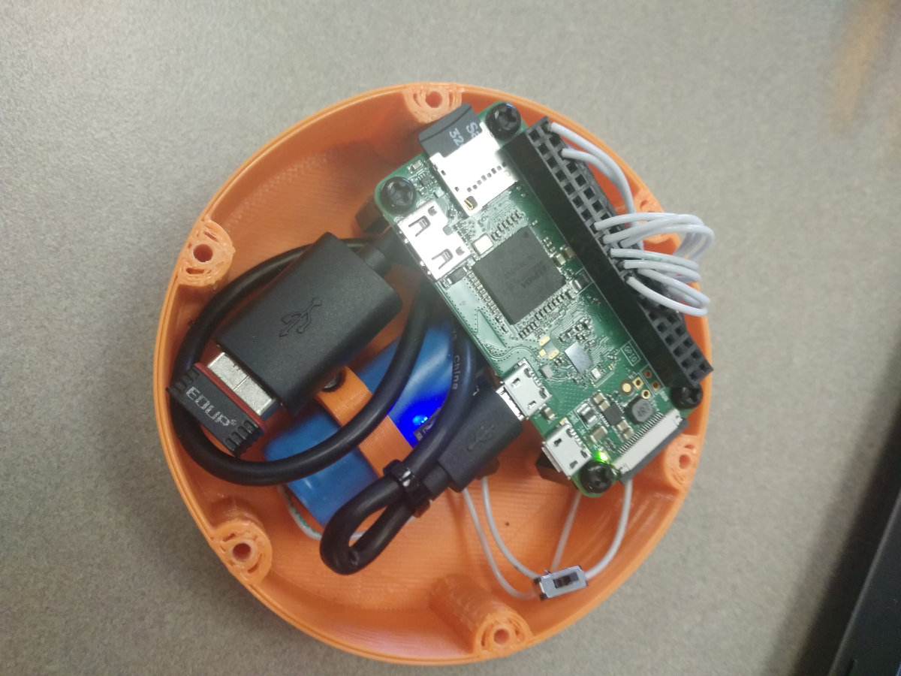
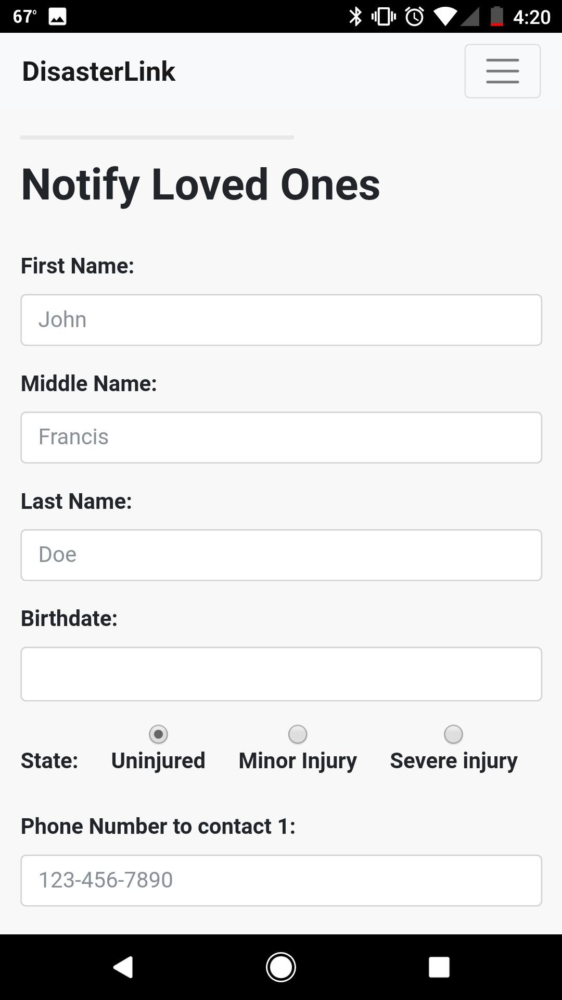

# DisasterLink

Grand Prize Winner for SkyHack 2017

DisasterLink is a check-in service for disaster situations that uses UAVs to collect and transmit information in areas that are otherwise without power or functional communication networks.

1. Drones drop mobile DisasterLink modules in disaster-stricken areas.
2. Nearby disaster survivors then check in and register information with these modules.
3. The transmit the information at long range to data collection drones.
4. The check-in data is stored and will help disaster relief efforts by verifying the name, location, and injury status of survivors, which may not otherwise be possible without power.

## How we built it

We built a working prototype of a DisasterLink module delivery drone. The module internals were built around a Raspberry-Pi Zero-w powered by a LiPo battery and utilizes a RF transmitter as well as its onboard wifi for communication. The housing was designed in Solidworks and 3D printed from PETG with a household FDM printer.

The Pi acts as a wifi hotspot and serves a webapp when it is connected to. The webapp was built with html and bootstrap css, and integrates with the Raspberry-Pi through wifi, allowing users to enter information. The Pi uses an RF module to transmit this data to a receiver, which processes the information allowing the users information to be seen by the rest of the world.

The drone is outfitted with a remote-actuated servo, which acts as the deployment mechanism for the module. The module uses a hand-sewn parachute to slow its decent and lower the shock load from ground impact, protecting the electronics inside.

